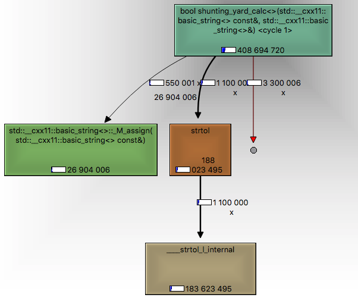
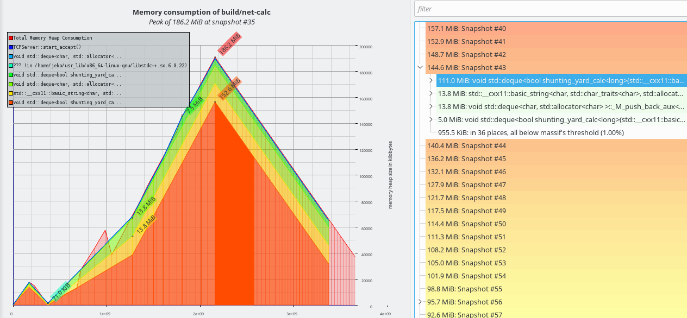

Async server to serve request for calculation infix expressions
===
Server serves requests, replies asynchroniously using boost asio on tcp port. 
https://www.boost.org/doc/libs/1_66_0/doc/html/boost_asio.html
Requests processing is done using pool of workers. Data transmitted by chunks and connection isn't closed after getting reply.
So client can stay online and send experssions interactively. Experssions are splitted by new line character ('\n') and are processed sequently for client. In the meantime sending results to clients is done as soon as result calculated by workers. Results are separated using '\n' character.
Infix expression is processed using shunting yard algorithm by Edsgner Dijkstra to reverse polish notation
 https://en.wikipedia.org/wiki/Shunting-yard_algorithm
 https://en.wikipedia.org/wiki/Polish_notation
There are also function for calculation expression using standart linux calc tool bc for debug and testing purposes.


## Building
```sh
$ mkdir build .
$ cd build
$ cmake ..
$ make
$ make test
$ ls
libnet_calc_lib.a net-calc calculator_gtest generate-expression
```
**linux thirdparties**
```sh
sudo apt-get install libgtest-dev libboost-dev libboost-system-dev
#sudo apt-get install netcat 
```

**mac thirdparties**
```sh
brew install --HEAD https://gist.githubusercontent.com/Kronuz/96ac10fbd8472eb1e7566d740c4034f8/raw/gtest.rb
brew install boost
```

## Running 
```sh
$ ./net-calc 127.0.0.1 9090
```

## Using
```sh
$ echo "(3+ 2*4) * 7" | nc 127.0.0.1 9090
```

## Benchmarking
```sh
$ ./generate-expression 1000000000 > expression_bench.txt
$ nc 127.0.0.1 9090 < expression_bench.txt
```


## Profiling

### HotSpots
Using valgrind callgrind, valgrind generates report, 
```sh
$ sudo apt-get install valgrind
$ valgrind --tool=callgrind  --dump-instr=yes --dump-line=yes --collect-jumps=yes build/net-calc 127.0.0.1 9090
# sudo apt-get install qcachegrind
$ qcachegrind 
```


### Memory
Using valgrind massif
```sh
$ sudo apt-get install valgrind
$ valgrind --tool=massif build/net-calc 127.0.0.1 9090
# sudo apt-get install massif-visualizer
# sudo add-apt-repository ppa:kubuntu-ppa/backports 
# sudo apt-get update
# sudo apt-get install massif-visualizer
$ massif-visualizer
```



